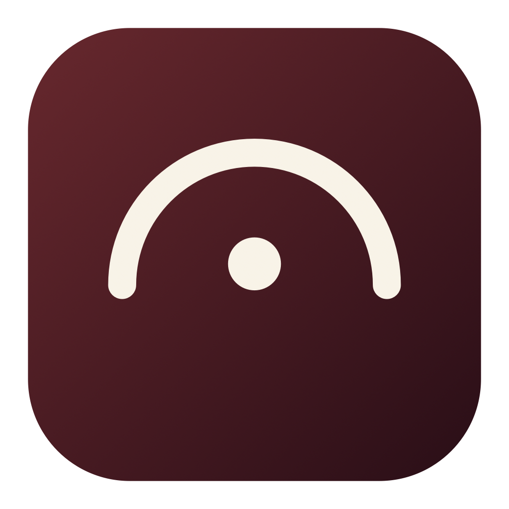

<p align="center">
  
</p>

<h1 align="center">Cadenza</h1>

<p align="center">
  <b>Apple Music Classical, native to macOS.</b><br>
  A SwiftUI library on top of Apple's own WebKit player, built around work, movement, recording, composer and performer.
</p>

<p align="center">
  <a href="LICENSE"></a>
  <a href="#install"></a>
  <a href="#how-it-works"></a>
  <a href="https://github.com/NspxMiguel/Cadenza/actions/workflows/ci.yml"></a>
</p>

<p align="center">
  <a href="#why">Why</a> ·
  <a href="#how-it-works">How it works</a> ·
  <a href="#what-it-does">Features</a> ·
  <a href="#setup">Setup</a> ·
  <a href="#install">Install</a> ·
  <a href="#audio-quality">Audio quality</a> ·
  <a href="#legal">Legal</a> ·
  <a href="docs/INDEX.md">Docs</a>
</p>

---

Cadenza is the Mac client Apple never shipped for Apple Music Classical. It pairs a native SwiftUI library with Apple's WebKit player, so browsing feels like a Mac app while playback stays inside Apple's supported DRM path.

Built in the spirit of [Cider](https://cider.sh): the web layer is used only as a
playback engine, and everything the user sees is native.

## Why

Apple Music Classical exists on iOS, iPadOS, Android and the web — but not as a Mac
app. Sideloading the iPad IPA gives you a window locked to portrait that cannot be
resized. The official web player works, but it is a browser tab pretending to be an app.

## How it works

Playback of full tracks requires FairPlay, and FairPlay decryption cannot leave
WebKit — there is no supported path to raw audio. So Cadenza does what Cider does:

- **Engine** — a `WKWebView` hosting Apple's player handles FairPlay decode and
  playback. It is driven over a JS bridge and is not the user interface. Nothing
  in this app intercepts, decrypts or stores the stream.
- **Data** — a native Swift client calls the classical catalog API directly
  (`classical.music.apple.com/api/classical/v10/query/*`), using the developer token
  the page already ships with. No paid Apple Developer account is required.
- **UI** — SwiftUI, built around how classical music is actually organised:
  work, movement, recording, composer, performer.

## What it does

- Browse and search the classical catalog by work, composer, recording and performer
- Play through your own Apple Music subscription, with a floating transport,
  an editable queue, media keys and Now Playing
- Full library writes: favourites, add/remove, and playlist create, rename,
  delete and reorder
- **Scores** — public-domain engravings from OpenScore (CC0) and seven Humdrum
  corpora, 1922 movements indexed, rendered with Verovio and following the music
  bar by bar. Lyrics share the same panel. A scanned score can be read by an
  optical-recognition pass and is kept, not re-scanned
- **Local files** — import MP3, AAC, ALAC, FLAC, WAV, AIFF, Opus and about
  twenty more, by panel or by dropping them on the window. These play at whatever
  they were encoded at, since no DRM stands in the way
- **Metadata editing** — correct composer, performers, album, genre, year, track
  number and cover art, for one track or a whole album at once
- **Google Drive** — keep the local files, and their corrected metadata, in one
  folder that follows you between Macs

## Setup

On first launch Cadenza walks through three things. Only the first is required.

1. **Apple Music** — sign in with your Apple ID, on Apple's own page. The app
   never sees the password.
2. **Your own files** — point it at a folder of music you already own.
3. **Google Drive** — one button, one Google sign-in, and the local library syncs.

Everything after the first step is skippable and can be done later in
**Ajustes ▸ Armazenamento**.

### Google Drive

<details>
<summary>Scope, sign-in model and Drive layout</summary>

Cadenza signs in as an OAuth **public client**: there is no client secret in this
repository, and there is no server in the middle. PKCE stands in for the secret and
the answer comes back through the app's own URL scheme.

The scope is `drive.file`, which means the app can only ever see files it created
itself — the rest of your Drive is out of its reach, by Google's enforcement rather
than by promise. Everything lands in one place:

```
Drive/
└── Cadenza/
    ├── biblioteca.json     ← titles, albums, composers, cover references
    └── Músicas/            ← the audio files themselves
```

The manifest is written last, so an interrupted upload never leaves a catalogue
promising files that are not there.

</details>

## Install

```bash
brew tap nspxmiguel/cadenza https://github.com/NspxMiguel/Cadenza
brew install --HEAD cadenza
```

The formula compiles from source on your machine and signs the result locally.
Because nothing is downloaded as a binary, there is no quarantine attribute and
Gatekeeper raises no "unidentified developer" prompt — the app just opens. Only
Command Line Tools are needed; a full Xcode install is not.

The app is linked into `~/Applications`.

## Build from a checkout

```bash
./build.sh
open build/Cadenza.app
```

For Lossless and Spatial Audio, build with a paid Apple Developer team:

```bash
CADENZA_TEAM=YOURTEAMID ./build.sh
```

See [docs/lossless.md](docs/lossless.md) for why that is required and what
changes when it is present.

## Audio quality

Three engines sit behind one `Player` protocol:

| Engine | Ceiling | Requirement |
|---|---|---|
| WebKit | 256 kbps AAC | none |
| Native MusicKit | Lossless + Spatial | MusicKit entitlement (paid membership) |
| Local files | whatever the file is | none |

The app probes for native MusicKit at launch and routes to it when available,
falling back to WebKit otherwise. **Ajustes ▸ Reprodução** forces either one and
explains what is missing when lossless is out of reach. The transport always
states the ceiling in effect, so the app never implies a quality it cannot deliver.

## Testing

<details>
<summary>Headless self-test and development tools</summary>

Parts of this app have no interface to inspect — a wrong score renders as
convincingly as a right one, and a tag that failed to parse looks like a tag that
was never there. Those run headless:

```bash
CADENZA_SELFTEST=1 ./.build/debug/Cadenza
```

Optional: `CADENZA_SELFTEST_TAGS=<file>` reads one file's tags and prints every
field; `tools/id3-fixture.py in.mp3 out.mp3` writes a fully tagged file to test
against.

`tools/qa-biblioteca.py` and `tools/discover.py` are development tools, not part
of the app. The first creates and deletes real playlists and library entries in
whichever account is signed in, and the second walks the private API. Neither is
invoked by Cadenza; read them before running either.

</details>

## Legal

- [Política de Privacidade](https://www.nspx.dev/Cadenza/privacidade.html)
- [Termos de Uso](https://www.nspx.dev/Cadenza/termos.html)
- [Licenças e créditos](https://www.nspx.dev/Cadenza/licencas.html)

The same texts are shown inside the app under **Ajustes ▸ Sobre**, and are
generated from `Sources/Cadenza/LegalText.swift` — the website cannot drift from
what the app says. Regenerate with:

```bash
CADENZA_EMIT_LEGAL=/tmp/legal ./.build/debug/Cadenza && python3 tools/emit-site.py /tmp/legal /tmp/site
```

Cadenza is an independent project, not affiliated with Apple Inc. or Google LLC.
Source code is MIT. The Humdrum score corpora are Craig Stuart Sapp's editions,
four of them under CC BY-NC-SA 4.0 — **the non-commercial clause binds anyone
redistributing this app while it ships them.**

## Caveats

The `v10` endpoints are private and undocumented. They carry no compatibility
guarantee and will break when Apple changes them; the data layer is kept isolated so
that breakage stays cheap to repair. This is a personal-use client.

Playlist cover art cannot be set: Apple's library API exposes no route for it,
and every verb tried against the obvious one is refused.

## Documentation

Index: [`docs/INDEX.md`](docs/INDEX.md)
