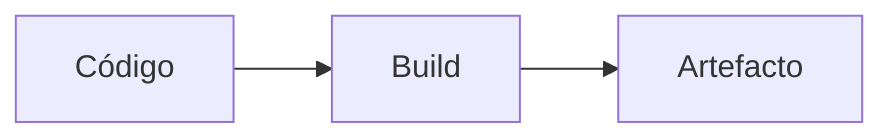

# Arquitetura — Cadenza

## Overview

<div align="center">


# Cadenza

**Apple Music Classical, native to macOS.**

[](#install)
[](#how-it-works)
[](#audio-quality)
[](LICENSE)

</div>

---

Cadenza is the Mac client Apple never shipped for Apple Music Classical. It pairs a native SwiftUI library with Apple's WebKit player, so browsing feels like a Mac app while playback stays inside Apple's supported DRM path.

Built in the spirit of [Cider](https://cider.sh): the web layer is used only as a
playback engine,

## Stack

- Package: `(sem name)` 
- Gestor: **npm**
- Workspaces: não
- Dependências (amostra): 

## Árvore

```
├── capture/
│   ├── endpoints.txt
│   ├── streams.txt
│   └── tokens.json
├── docs/
│   ├── img/
│   ├── api-v10.md
│   ├── library-writes.md
│   ├── lossless.md
│   └── scores.md
├── Formula/
│   └── cadenza.rb
├── Resources/
│   └── Cadenza.icns
├── Sources/
│   ├── Cadenza/
│   └── MusicKitProbe/
├── tools/
│   ├── build-probe.sh
│   ├── decode-test.sh
│   ├── discover.py
│   ├── emit-site.py
│   ├── id3-fixture.py
│   ├── make-icon.swift
│   └── qa-biblioteca.py
├── build.sh
├── LICENSE
├── Package.swift
└── README.md
```



## Scripts disponíveis

| Script | Comando |
|--------|---------|

