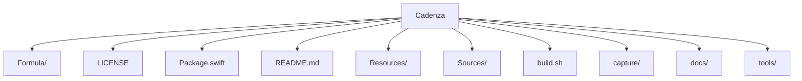

# Estrutura — Cadenza

## Pastas de topo

```
Cadenza/
├── Formula/
├── LICENSE
├── Package.swift
├── README.md
├── Resources/
├── Sources/
├── build.sh
├── capture/
├── docs/
├── tools/
```

## Diagrama



## Componentes / módulos importantes

### `Sources/`

- `Cadenza/`
- `MusicKitProbe/`
